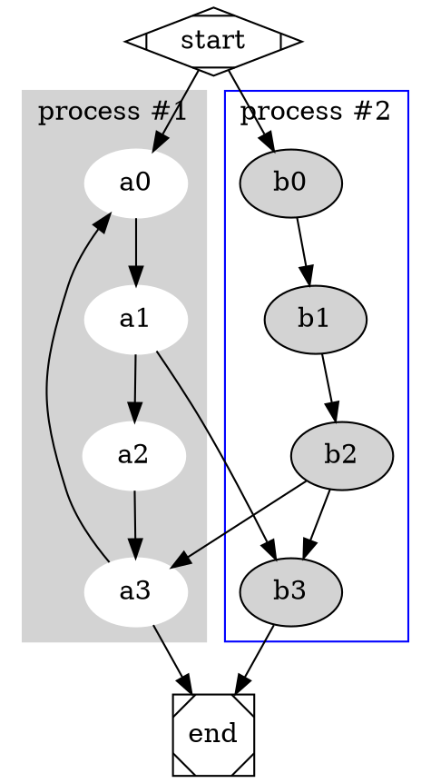

With the recent adoption of Infrastructure as Code we aim to eliminate the
impudent mismatch of documentation (eg. how is it supposed to look like) and how
it actually set up by driving all changes from a textual representation.

While JSON, YAML and HCL does a good job of representing out intent to a
computer it is not easily consumable for humans - unless you live and breath for
these types of configuration languages 🧙‍♂️

A diagram does a much better job of conveying information and relationships to
us mortal humans but they struggle to keep up with the never ending changes as
they are often hand drawn and a snapshot somewhere in time. Who knows where the
master file for that one Visio diagram is, right?!

What if we could generate our diagrams in the same way as we generate our
infrastructure?

This post aims to give an overview of the current state of diagram tools that
support some kind of Diagram as Code functionality. Lets dig in! 😄

## Overview

Bellow is a table over the most popular tools with support for Diagram as Code.
We have included some popular proprietary tools in the list but will leave it as
an exercise to the reader to explore those as this post will focus on those that
are free and open source.

| Tool                                               | Diagram Language                                            | License                                                                                | Local | Online |
| -------------------------------------------------- | ----------------------------------------------------------- | -------------------------------------------------------------------------------------- | ----- | ------ |
| [Graphviz](https://graphviz.org/)                  | [DOT](https://graphviz.gitlab.io/_pages/doc/info/lang.html) | [Eclipse Public License 1.0](https://gitlab.com/graphviz/graphviz/blob/master/LICENSE) | ✅     | ✅      |
| [PlantUML](https://plantuml.com/)                  | Text                                                        | [GPL-3.0](https://sourceforge.net/p/plantuml/code/HEAD/tree/trunk/src/)                | ✅     | ✅      |
| [Mermaid](https://mermaid-js.github.io/mermaid/#/) | Text                                                        | [MIT License](https://github.com/mermaid-js/mermaid/blob/develop/LICENSE)              | ✅     | ✅      |
| [Ditaa](http://ditaa.sourceforge.net/)             | ASCII                                                       | [LGPL-3.0](https://github.com/stathissideris/ditaa/blob/master/LICENSE)                | ✅     | ❌      |
| [WSD](https://www.websequencediagrams.com/)        | Text                                                        | ❌                                                                                      | ❌     | ✅      |
| [code2flow](https://code2flow.com/)                | Text                                                        | ❌                                                                                      | ❌     | ✅      |
| [Structurizr](https://structurizr.com/)            | Java, .NET                                                  | ❌                                                                                      | ❌     | ✅      |

## Graphviz ([Live Demo](https://dreampuf.github.io/GraphvizOnline))

> Rock solid, and bindings for just about every language!


Graphviz is an open source graph visualization software written in C. It has
several main layout programs. It also has web and interactive graphical
interfaces, and auxiliary tools, libraries, and a rich set of language bindings.
The main project itself is not investing in graphical user interface editors,
but leaving that up to the community to incorporate Graphviz. This results in
Graphviz often being perceived as a little more low-level compared with the
others.

The Graphviz layout programs take descriptions of graphs in a simple text
language named DOT, and make diagrams in useful formats, such as images and SVG
for web pages; PDF or Postscript for inclusion in other documents; or display in
  an interactive graph browser.

Graphviz has many useful features for concrete diagrams, such as options for
colors, fonts, tabular node layouts, line styles, hyperlinks, and custom shapes.

In practice, graphs are usually generated from an external data sources, but
they can also be created and edited manually, either as raw text files or within
a graphical editor. (Graphviz was not intended to be a Visio replacement, so it
is probably frustrating to try to use it that way.)

### Example diagram



## PlantUML ([Live Demo](https://plantuml.com/))

> PlantUML is, imho, the most efficient and maintainable way to produce UML
> diagram.


PlantUML is another trued and true tool used written in Java to draw primarily
UML diagrams, using a simple and human readable text description. Be careful,
because it does not prevent you from drawing inconsistent diagrams (such as
having two classes inheriting from each other, for example). So it's more a
*drawing* tool than a *modeling* tool.

PlantUML has its own simple, but powerful, domain specific language (DSL) that
allows for a lot of different types of UML diagrams:

* Sequence diagrams
* Usecase diagrams
* Class diagrams
* Activity diagrams
* Component diagrams
* State diagrams
* Object diagrams
* Deployment diagrams
* Timing diagrams

Also, it supports some non-UML diagrams which are pretty cool, for example the
Wireframe diagrams for UI design. Fun fact some of the diagrams in PlantUML is
actually powered by Graphviz.

PlantUML is also supported in [GitLab
markdown](https://docs.gitlab.com/ee/administration/integration/plantuml.html)
and there is an integration for [VS
Code](https://marketplace.visualstudio.com/items?itemName=jebbs.plantuml),
[Atom](https://atom.io/packages/plantuml-viewer),
[MediaWiki](https://www.mediawiki.org/wiki/Extension:PlantUML), [Google
Docs](https://chrome.google.com/webstore/detail/plantuml-gizmo/gkhhgpmifdpiagjagcbconfnnhkmomnp)
as well as [Microsoft Word](https://plantuml.com/word) to mention a few and this
greatly expends its usefulness!

PlantUML is primarily an UML drawing tool, and maybe the best there is. However,
it is starting to show it's age along with the JVM, it's lack of modern diagram
styling and web integrations.

## Example Diagram

```
skinparam style strictuml
class Façade {
 doSomething()
}
Façade .> package1.Class1
Façade .> package2.Class2
Façade .> package3.Class3
Client1 .> Façade : doSomething()
Client2 .> Façade : doSomething()
note as N2
doSomething() {
  Class1 c1 = newClass1();
  Class2 c2 = newClass2();
  Class3 c3 = newClass3();
  c1.doStuff(c2)
  c3.setX(c1.getX());
  return c3.getY();
}
end note
Façade .. N2
```

## Mermaid ([Live Editor](https://mermaid-js.github.io/mermaid-live-editor/))

> Mermaid lets you easily do is generate sequence diagrams from code such as
> test-cases, because the format is so simple and line-driven ✨


Mermaid is a diagram tool built for the web-era with native JavaScript support
just include the js file and start rendering diagrams real time. It does not
support as many diagrams as it's competitors (yet) but it is completely
themeable and has a rich and powerful syntax.

Mermaid is not a particular UML tool but rather a more general purpose diagram
tool and supports the following diagrams:

* [Flowchart](https://mermaid-js.github.io/mermaid/#/flowchart)
* [Sequence diagram](https://mermaid-js.github.io/mermaid/#/sequenceDiagram)
* [Class Diagram](https://mermaid-js.github.io/mermaid/#/classDiagram)
* [State Diagram](https://mermaid-js.github.io/mermaid/#/stateDiagram)
* [Gnatt](https://mermaid-js.github.io/mermaid/#/gantt)
* [Pie Chart](https://mermaid-js.github.io/mermaid/#/pie)

Comparing with Visio and similar applications, mermaid is a really fast way to
create good visualizations. This is especially apparent when editing a complex
visualization, this could take hours in traditional tool but takes minutes (or
even less if generation has been scripted) with mermaid.

Mermaid also has support for Graphviz's dot graph notation which makes it super
easy to reusing existing diagrams and it is fully integrated with
https://docs.gitlab.com/ee/user/markdown.html! It has a [VS
Code](https://marketplace.visualstudio.com/items?itemName=vstirbu.vscode-mermaid-preview),
[Atom](https://atom.io/packages/atom-mermaid), [Google
Chrome](https://chrome.google.com/webstore/detail/mermaid-diagrams/phfcghedmopjadpojhmmaffjmfiakfil),
[Confluence](https://marketplace.atlassian.com/apps/1214124/mermaid-plugin-for-confluence)
extensions and the [typora.io](https://typora.io/) markdown editor comes with
full Mermaid diagram support out of the box.

Memaid's strongest suite is it's simplicity and modern look and feel. For
frontend developers this would be like any other JavaScript library. It's
strongest suite is also it's disadvantage requiring
[PhantomJS](https://phantomjs.org/) (and thus 500 MB of compiled Chromium) in
order to render diagrams from the command line.

## Example Diagram

[Mermaid syntax guide](https://github.com/mermaidjs/mermaid-gitbook/blob/master/content/sequenceDiagram.md).

```
graph TD
A[Christmas] -->|Get money| B(Go shopping)
B --> C{Let me think}
C -->|One| D[Laptop]
C -->|Two| E[iPhone]
C -->|Three| F[fa:fa-car Car]
```

<div class="mermaid">graph TD
A[Christmas] -->|Get money| B(Go shopping)
B --> C{Let me think}
C -->|One| D[Laptop]
C -->|Two| E[iPhone]
C -->|Three| F[fa:fa-car Car]
</div>

**NB!** The above diagram is rendered live using the latest version of Mermaid
inkluded in this blogpost - just take a look at the source code. Happy
diagramming! 😄
